# EM-Waveguide-Antenna-Compendium-Theory-Design-and-Pattern
A dual-module engineering repository covering the fundamental and principles of Electromagnetics. Part 1 explores diverse Antenna topologies (Dipole, Patch, Horn) with a focus on radiation characteristics and impedance matching. Part 2 provides a deep dive into Waveguide theory, detailing mechanical components, mode analysis, and feed structures.

## TABLE OF CONTENTS
* [The Foundation: Electromagnetic Wave Theory](#part-1-analog-frequency-modulation--demodulation)
* [PART 1 : Antenna Systems & Radiators](#part-1--antenna-systems--radiators)
* [Part 2: Waveguide and its parts](#part-2-sampling-and-reconstruction)
* [Compilation of Images](#results--data-analysis)

## The Foundation: Electromagnetic Wave Theory
Electromagnetic (EM) waves are energy-carrying, transverse waves produced by the acceleration of charged particles, such as electrons. They consist of oscillating electric and magnetic fields that are perpendicular to each other and to the direction of propagation. EM waves require no medium and travel through a vacuum at the speed of light.

All antennas and waveguides in this repository are governed by Maxwell’s Equations. These equations describe how electric fields ($\mathbf{E}$) and magnetic fields ($\mathbf{H}$) interact and propagate through different media.

#### The Governing Equations
In a source-free, lossless medium, the propagation of EM waves is derived from the differential form of Maxwell's Equations:
- Faraday’s Law: $\nabla \times \mathbf{E} = -j\omega\mu\mathbf{H}$
- Ampère’s Law: $\nabla \times \mathbf{H} = j\omega\epsilon\mathbf{E}$
From these, we derive the Helmholtz Wave Equation, which defines how waves travel through space or are confined within a waveguide:
$$\nabla^2 \mathbf{E} + k^2 \mathbf{E} = 0$$
Where $k = \omega\sqrt{\mu\epsilon}$ is the wave number.

#### Wave Propagation & Impedance
For an antenna to radiate efficiently, we must manage the Intrinsic Impedance ($\eta$) of the medium. In free space, this is approximately 377 $\Omega$:
$$\eta_0 = \sqrt{\frac{\mu_0}{\epsilon_0}} \approx 120\pi \approx 377 \, \Omega$$
- Antenna Role: Acts as an impedance transformer between the transmission line ($50 \, \Omega$) and free space ($377 \, \Omega$).
- Waveguide Role: Constrains the EM wave to prevent spherical spreading, maintaining high power density over long distances.

#### Polarization and Phase
A professional RF design must account for how the field vectors are oriented:
- Linear Polarization: The E-field stays in a single plane (common in Dipoles/Horns).
- Circular/Elliptical: The E-field rotates as it propagates (common in Satellite Comm).

## PART 1 : Antenna Systems & Radiators
### Fundamental Antenna Theory
An antenna is a transducer designed to transition electromagnetic energy between a guided medium (like a coaxial cable or waveguide) and an unguided medium (free space).

#### The Radiation Mechanism
Radiation occurs when charges are accelerated or decelerated. In a transmission line, the E and H fields are confined. As the line geometry changes (e.g., the wires flare out), the fields "detach" from the conductor and form self-sustaining loops that propagate into space as electromagnetic waves.

#### Key Performance Metrics
To evaluate the "professionalism" of an antenna design, we look at four critical parameters:
- Impedance Matching ($S_{11}$): Measures how much power is reflected back to the source. A professional goal is usually $S_{11} < -10$ dB (less than 10% power reflection).
- VSWR (Voltage Standing Wave Ratio): A ratio describing how well the antenna is matched to the transmission line. Ideal is $1:1$; acceptable is usually $< 2:1$.+1
- Gain and Directivity: * Directivity ($D$): The ability of an antenna to focus energy in a specific direction.
  - Gain ($G$): Directivity minus the losses within the antenna ($G = \eta D$).
- Bandwidth: The range of frequencies over which the antenna maintains acceptable performance (typically based on $S_{11}$ or gain).

#### The Reciprocity Theorem
A fundamental principle in antenna theory is Reciprocity, which states that the electrical characteristics of an antenna (like gain and radiation pattern) are identical whether the antenna is transmitting or receiving. This allows engineers to test antennas in one mode and trust the results for the other.

#### Near-Field vs. Far-Field
The space surrounding an antenna is divided into regions:
- Reactive Near-Field: Energy is stored, not radiated.
- Radiating Near-Field (Fresnel): The radiation pattern begins to form.
- Far-Field (Fraunhofer): The region where the radiation pattern is stable and the waves are approximately planar. This is where communication happens.

The boundary for the far-field is typically defined as:
$$R > \frac{2D^2}{\lambda}$$
Where $D$ is the largest dimension of the antenna.
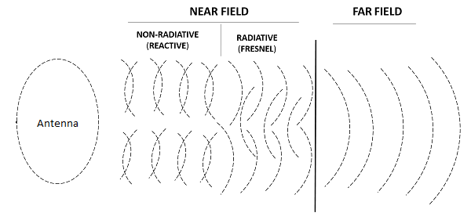

*Figure 1.1: Antenna Field Regions.*

## Different types of Antenna 
### Axial-Mode Helical Antenna

*Figure 1.2: Fabricated Axial-Mode Helical Antenna. Designed for circular polarization and directional high-gain performance. The design features a helical radiator supported by a dielectric central column over a truncated octagonal ground plane.*

#### Theory and Function
The Helical antenna consists of a conducting wire wound in the form of a screw thread (helix).
- The Ground Plane: The copper-colored base acts as a reflector. It ensures that the radiation is directed primarily upwards along the axis of the helix rather than dissipating behind it.
- Axial Mode: When the circumference of the helix is approximately equal to one wavelength ($\lambda$), the antenna operates in "Axial Mode." In this mode, the maximum radiation is along the axis of the helix (upward from the base).
- Circular Polarization: One of the most unique properties of this antenna is that it naturally produces Circular Polarization (CP). Because the current travels in a circle while moving forward, the resulting electromagnetic wave "twists" as it travels.
#### Propagation Pattern
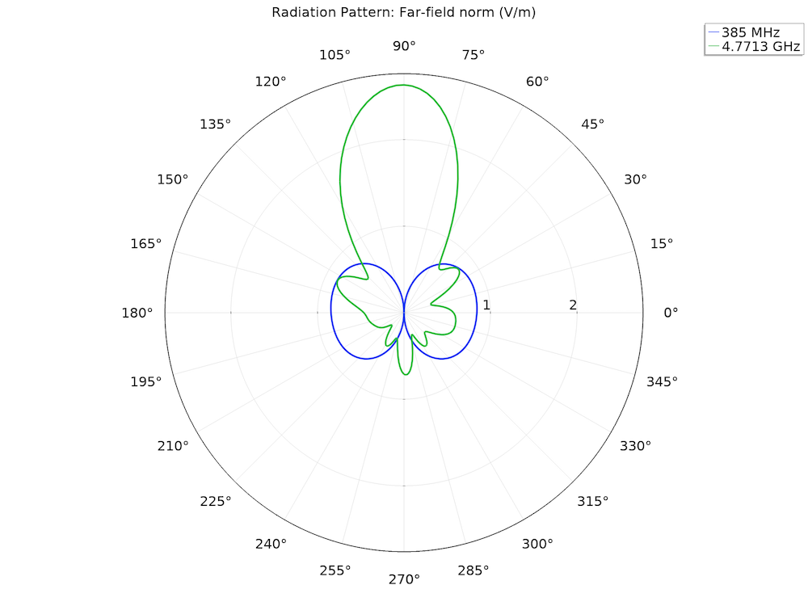
*Figure 1.3: Fabricated Axial-Mode Helical Antenna Propagation Pattern.*
The radiation pattern for this specific configuration is Directional.
- Main Lobe: A broad beam directed straight out from the top of the coil.
- Polarization: Right-Hand Circular Polarization (RHCP) or Left-Hand Circular Polarization (LHCP), depending on the direction of the winding.
- Gain: The gain increases as you add more turns to the coil. Your model has roughly 3–4 turns, providing moderate to high directivity.
#### Industrial Applications
Due to its circular polarization, the Helical antenna is the industry standard for situations where the transmitter and receiver might rotate or change orientation:
- Satellite Communications: Circular polarization helps the signal pass through the ionosphere without "Faraday Rotation" flipping the signal's phase.
- GNSS/GPS: Most GPS receivers use a form of helical antenna to maintain a lock on satellites regardless of the device's tilt.
- Space Telemetry: Used by NASA and SpaceX for tracking rockets and satellites during launch.
- FPV Drones: Highly popular in drone racing to ensure a stable video link even when the drone is performing flips and rolls.

### Microstrip Patch Antennas (Planar Radiators)
2.jpg)
*Figure 1.4: Matched Pair of Rectangular Microstrip Patch Antennas. Planar radiators etched on an FR-4 substrate. These prototypes demonstrate the low-profile advantages of patch technology, commonly utilized in phased arrays and integrated wireless systems.*
#### Theory & Function
A Microstrip Patch antenna consists of a radiating "patch" of metal on one side of a dielectric substrate (the green PCB) with a continuous ground plane on the other side.
- The Radiating Element: The metallic rectangular area is usually $\lambda/2$ in length. Radiation occurs primarily from the "fringing fields" at the edges of the patch.
- Dielectric Substrate: The material between the patch and the ground (likely FR-4 in this prototype) slows down the wave, allowing the antenna to be smaller than a dipole in free space.
- Feeding Mechanism: These prototypes appear to use a connector block (grey) which likely houses an SMA or U.FL interface to feed the signal directly to the patch.
#### Propagation Pattern
-Propagation-Pattern.jpg)

*Figure 1.5: Microstrip Patch Antennas (Planar Radiators) Propagation Pattern.*
Microstrip patches are Semi-Directional.
- Main Lobe: They radiate primarily into the "upper half-space" (perpendicular to the board).
- Back-Radiation: The ground plane on the bottom significantly reduces radiation behind the antenna, making it ideal for mounting on flat surfaces.
- Beamwidth: Usually provides a wide beam (approx. 60° to 90°), which is excellent for general-purpose coverage.
#### Industrial Applications
Because they are flat, lightweight, and can be manufactured using standard PCB processes, they are everywhere:
- Mobile Devices: Smartwatch and smartphone GPS/Bluetooth antennas.
- Wi-Fi Routers: Internal antennas in modern sleek routers.Automotive Radar: 77GHz radar sensors for collision avoidance and adaptive cruise control.
- Wearable Technology: Biomedical sensors that need to be flush against the skin.

### Quarter-Wave Monopole Antenna
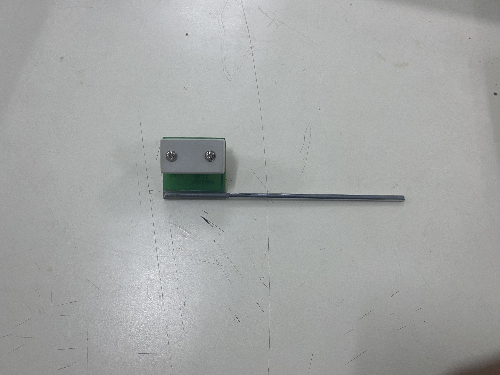
*Figure 1.6: Fabricated Quarter-Wave Monopole Antenna. This prototype features a rigid metallic radiator mounted to a custom PCB feed-point. It is designed for omnidirectional coverage, utilizing the ground plane reflection to achieve dipole-equivalent radiation characteristics.*
#### Theory & Function
A Monopole antenna is a single-element radiator that functions as one-half of a dipole. To operate correctly, it must be mounted over a Conductive Ground Plane.
- Method of Images: The ground plane acts like a mirror, creating a "virtual" image of the rod below the surface. This creates an effective dipole structure.
- Resonance: For maximum efficiency, the length of the rod is typically manufactured to be a quarter-wavelength ($\lambda/4$) of the target frequency.
#### Propagation Pattern
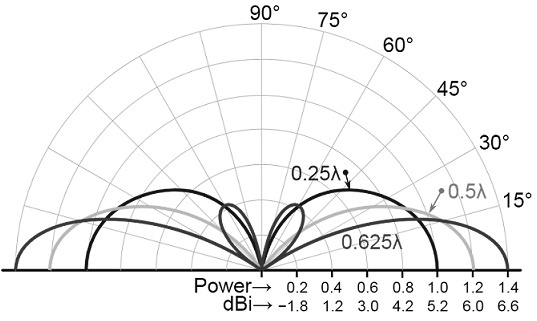

*Figure 1.7: Quarter-Wave Monopole Antenna Propagation Pattern.*
- Pattern Shape: It produces an Omnidirectional pattern in the horizontal plane (the azimuth).
- Null Point: There is a distinct "null" directly off the tip of the rod, meaning it does not radiate energy straight up along its axis.
- Polarization: It is vertically polarized, meaning the E-field oscillates up and down.
#### Industrial Applications
- Handheld Radios: Standard "rubber ducky" antennas on walkie-talkies.
- Automotive: AM/FM radio antennas on car roofs (where the car's metal body acts as the ground plane).
- IoT/M2M: Used in smart utility meters and wireless industrial sensors.

### Telescopic Monopole Antenna
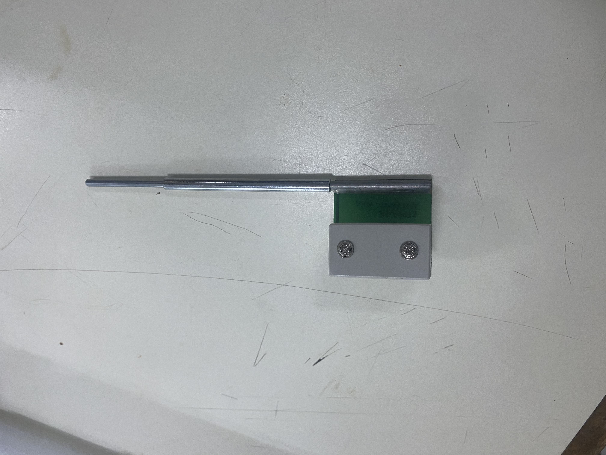
*Figure 1.8: Fabricated Telescopic Monopole Prototype. This design utilizes a multi-section adjustable radiator to demonstrate frequency tunability and bandwidth optimization. It serves as a practical model for studying the relationship between physical aperture length and resonant frequency.*
#### Theory & Function
The telescopic monopole operates on the same quarter-wave ($\lambda/4$) principle as the rigid monopole, but it is composed of several nested metallic tubes.
- Frequency Agility (Tunability): This is its most important feature. Since the resonant frequency of a monopole is inversely proportional to its length ($f \propto 1/L$), sliding the sections in or out allows the user to manually "tune" the antenna to different frequencies.
- Mechanical Advantage: It provides high portability, allowing a long radiator required for lower frequencies (like FM radio) to be collapsed into a small form factor when not in use.
- Inductive Loading: In some designs, if the antenna cannot be fully extended to the required $\lambda/4$ length, it can be electronically "lengthened" using a loading coil at the base to maintain resonance.
#### Propagation Pattern

*Figure 1.9: Telescopic Monopole Antenna Propagation Pattern.*
- Radiation Shape: Like all monopoles, it produces an Omnidirectional pattern in the azimuth ($360^\circ$ coverage).
- Elevation Sensitivity: As you extend the antenna beyond $\lambda/4$ (for example, to $5\lambda/8$), the radiation pattern flattens, focusing more energy toward the horizon and increasing the gain.
- Polarization: Stays strictly vertical. If the antenna is tilted, the polarization shifts, which can lead to signal loss (polarization mismatch).
#### Industrial Applications
- Portable Receivers: The classic "whip" antenna on portable FM/AM radios and shortwave receivers.
- Testing & Measurement: Often used with handheld Spectrum Analyzers to "sweep" a room for signals, as the length can be adjusted to find the peak resonance of an unknown transmitter.
- Emergency Communications: Used in deployable "Go-Kits" for search and rescue or amateur radio (Ham radio) where equipment must be compact but capable of reaching long distances.

### Dipole Antenna (1/4 $\lambda$)
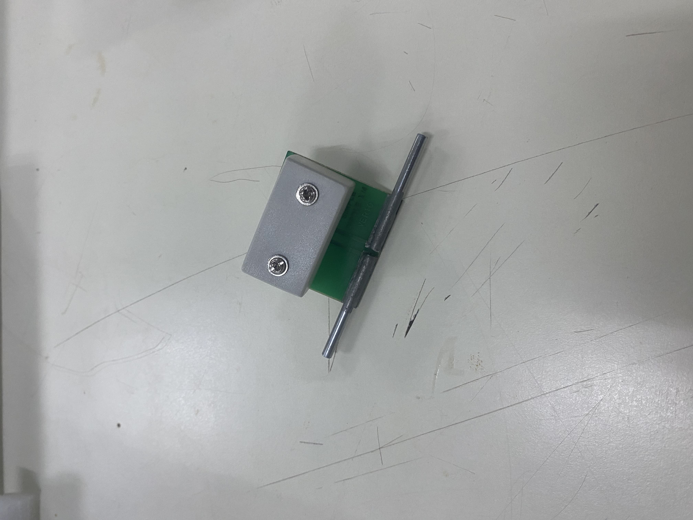
*Figure 1.10: Center-Fed Half-Wave Dipole Prototype. This design demonstrates a balanced resonant structure. By eliminating the requirement for a conductive ground plane, this antenna provides a toroidal radiation pattern with a characteristic 2.15 dBi gain, serving as the fundamental reference for the other radiators in this compendium.*

#### Theory & Function
The dipole is the most fundamental and widely used antenna in radio communications. It consists of two poles (conductive rods) oriented end-to-end with a total length usually equal to a half-wavelength ($\lambda/2$).Balanced Feed: Unlike the monopole, which is unbalanced, the dipole is a balanced antenna. Power is fed into the center, where the two rods meet.Resonance: Each arm is approximately $\lambda/4$ in length. When current flows, it reaches the ends of the rods and reflects, creating a standing wave that facilitates radiation.No Ground Plane Required: Because it has two physical poles, it does not rely on a ground plane to function, making it more versatile for mounting high in the air or on non-metallic structures.
#### Propagation Pattern
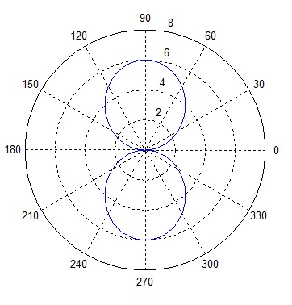

Figure 1.11: Dipole Antenna (1/4 $\lambda$) Propagation Pattern.*
- Doughnut Shape (Toroidal): The radiation pattern is omnidirectional in the plane perpendicular to the rods, but it has deep "nulls" (no signal) at the very tips of the rods.
- Gain: A standard half-wave dipole has a theoretical gain of 2.15 dBi.
- Polarization: It is linearly polarized. If the rods are horizontal, it is horizontally polarized; if they are vertical, it is vertically polarized.
#### Industrial Applications
- Television & Radio: The classic "rabbit ears" on old TVs are adjustable dipoles.
- Ham Radio: Many amateur radio operators use wire dipoles strung between trees for long-distance communication.Reference Standard: In labs, dipoles are used as the "gold standard" to measure the gain of other, more complex antennas.
- Antenna Arrays: Many large cell towers use a vertical stack of several dipoles to focus the signal toward the horizon.

### Dipole Antenna (1/2 $\lambda$)
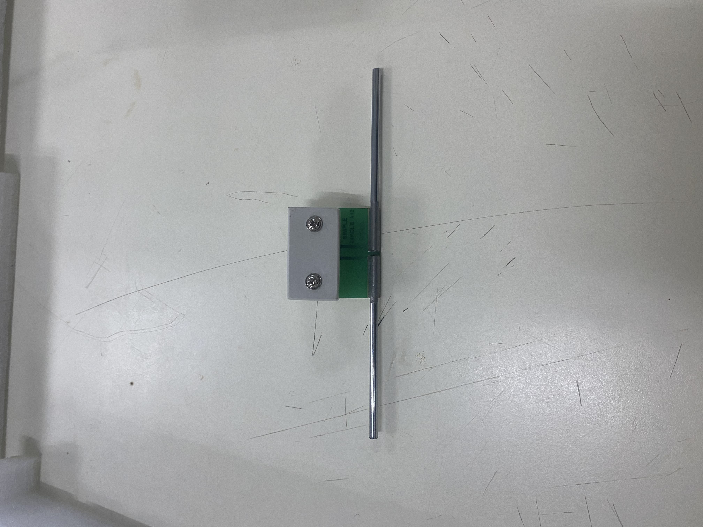
Figure 1.12:  Fabricated Half-Wave ($\lambda/2$) Dipole Antenna. This prototype represents the fundamental balanced radiator used in RF engineering. Featuring symmetric arms and center-point feeding, it provides a toroidal radiation pattern and serves as the primary reference standard for gain and directivity measurements.*

#### Theory & Function
A dipole is a balanced antenna, consisting of two identical conductive elements (arms) oriented end-to-end.
- Resonant Length: For the antenna to radiate efficiently, its total length must be approximately half of the wavelength ($\lambda/2$) of the signal you are transmitting or receiving.
- Voltage and Current Distribution: At resonance, the current is at its maximum at the center (feed point) and zero at the ends, while the voltage is at its maximum at the tips.
- Impedance: A theoretical half-wave dipole in free space has an input impedance of approximately 73 $\Omega$, which is a relatively close match to standard $50\ \Omega$ or $75\ \Omega$ transmission lines.
#### Propagation Pattern

Figure 1.13: Dipole Antenna (1/2 $\lambda$) Propagation Pattern.*
- Toroidal (Doughnut) Shape: The dipole radiates energy in a 360° circle perpendicular to the arms. However, it has "nulls" at the ends of the rods where virtually no signal is sent or received.
- Standard Gain: It has a fixed directive gain of 2.15 dBi. When you see other antennas rated in "dBd," they are being compared directly to this specific antenna.
- Polarization: It is Linearly Polarized. To communicate effectively, the receiving dipole must be oriented in the same direction (e.g., both vertical or both horizontal).
#### Industrial Applications
- Reference Standards: Used in laboratories to calibrate other antennas.
- Television: The classic "rabbit ears" are a pair of adjustable dipoles.
- Radio Towers: Many cellular and broadcast towers use "stacks" of dipoles to increase signal strength toward the horizon.
- Emergency Services: Simple wire dipoles are often used in field deployments for Search and Rescue because they are easy to build and require no ground plane.

### Dipole Antenna (3/2 $\lambda$)
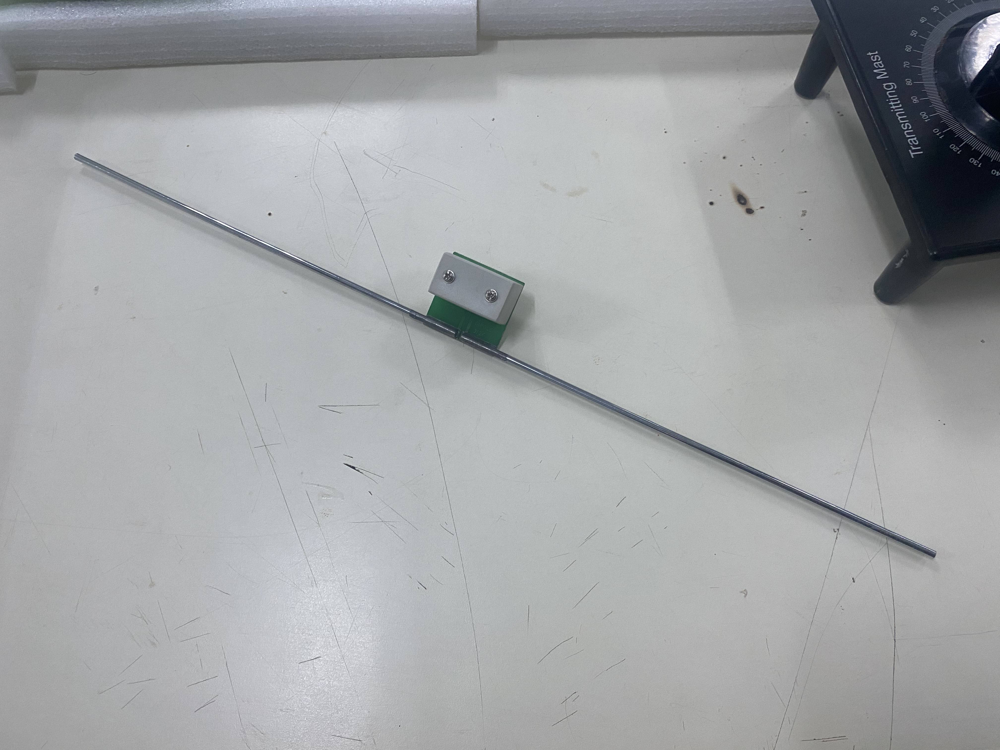
*Figure 1.14: Center-Fed Half-Wave Dipole Prototype. This design demonstrates a balanced resonant structure. By eliminating the requirement for a conductive ground plane, this antenna provides a toroidal radiation pattern with a characteristic 2.15 dBi gain, serving as the fundamental reference for the other radiators in this compendium.*

#### Theory & Function
As the physical length of a dipole increases beyond $\lambda/2$, the current distribution along the arms no longer consists of a single "hump."
- Current Reversal: In a $\frac{3}{2}\lambda$ dipole, the current undergoes phase reversals along the length of the wire. This means there are three distinct regions of maximum current (current loops) rather than one.
- Higher Radiation Resistance: This antenna typically exhibits a higher radiation resistance compared to a standard half-wave dipole, which affects how it is matched to a $50\ \Omega$ or $75\ \Omega$ feedline.
- Harmonic Resonance: This antenna is technically a "harmonic" antenna, as it resonates at the third harmonic of its fundamental frequency.
#### Propagation Pattern
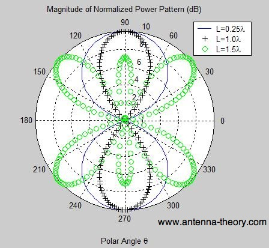

Figure 1.15: Dipole Antenna (3/2 $\lambda$) Propagation Pattern.*

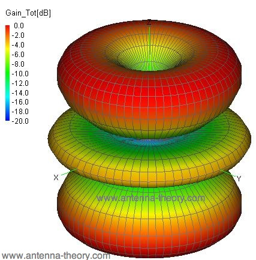

Figure 1.16: Dipole Antenna (3/2 $\lambda$) 3D Propagation Pattern.*

This is the most striking difference. Unlike the "doughnut" shape of a standard dipole, the $\frac{3}{2}\lambda$ dipole "breaks" the signal into multiple lobes.
- Multi-Lobe Pattern: Instead of one broad main lobe, this antenna produces six distinct lobes.
- Increased Gain: Because the lobes are narrower and more numerous, the antenna can achieve a higher peak gain in certain directions compared to a standard $\lambda/2$ dipole.
- Angle of Radiation: The main lobes are tilted at an angle toward the ends of the wire rather than being strictly perpendicular to the antenna axis.
#### Industrial Applications
- Directional Communications: Used when a designer wants to "steer" the signal into specific angular sectors without using a complex array.
- Shortwave (HF) Broadcasting: Large-scale wire antennas often use harmonic lengths like $\frac{3}{2}\lambda$ to achieve higher gain for long-distance ionospheric "skip" communications.
- Multi-band Antennas: Often found in amateur radio setups where a single long wire is used to operate on multiple different frequency bands.

### Folded Dipole Antenna 
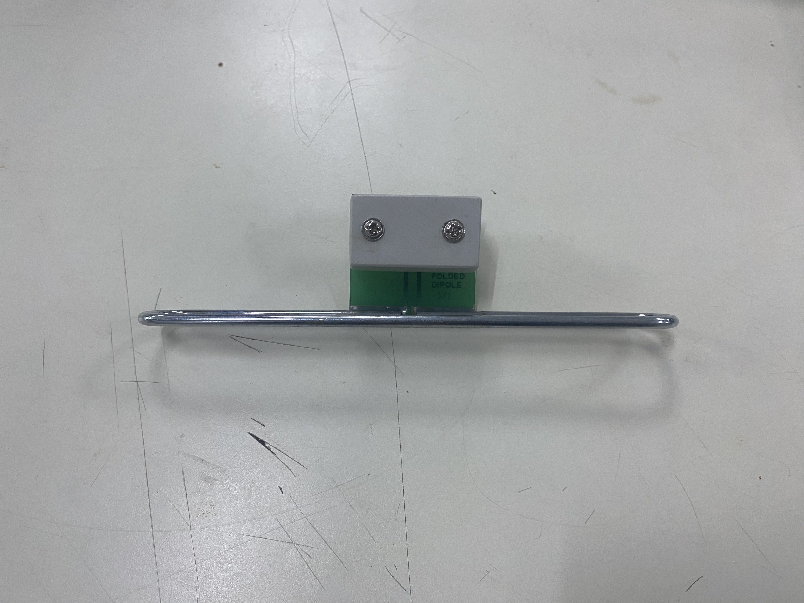
*Figure 1.17: Fabricated Folded Dipole Antenna. This prototype utilizes a continuous-loop geometry to achieve a 4:1 impedance transformation relative to a standard dipole. The design is optimized for high-bandwidth applications and serves as a primary driven element for multi-element parasitic arrays.*

#### Theory & Function
A folded dipole is formed by taking a standard half-wave dipole and connecting a second conductor in parallel.
- Impedance Transformation: The most notable characteristic is the Impedance Step-Up. A folded dipole has an input impedance roughly four times that of a standard dipole. While a basic dipole is $\approx 73\ \Omega$, a folded dipole provides an impedance of approximately $300\ \Omega$.
- Increased Bandwidth: The parallel conductors increase the effective "thickness" of the antenna. In RF physics, thicker radiators exhibit lower $Q$ factors, which translates to a wider operating bandwidth. This allows the antenna to maintain a good match across a broader range of frequencies.
- Folded Current: Because the two arms are in close proximity, the currents in both segments are in phase, contributing equally to the total radiated field.
#### Propagation Pattern

*Figure 1.18: Folded Dipole Antenna Propagation Pattern.*

- Radiation Shape: The propagation pattern remains Toroidal (Doughnut-shaped), identical to a standard half-wave dipole. It radiates 360° perpendicular to the axis of the rods.
- Directivity/Gain: It maintains a standard gain of approximately 2.15 dBi.
- Polarization: Linear polarization along the axis of the parallel tubes.
#### Industrial Applications
- Television Reception: Historically, the  impedance was a perfect match for "twin-lead" ribbon cables used for rooftop TV antennas.
- Yagi-Uda Arrays: It is the most common "driven element" in Yagi antennas (like those on old houses). The high impedance of the folded dipole compensates for the impedance-lowering effects caused by the nearby director and reflector elements.
- FM Radio: Preferred for FM reception because its wider bandwidth can easily cover the entire 88–108 MHz broadcast band without significant signal loss.

### Folded Dipole with Detector Antenna
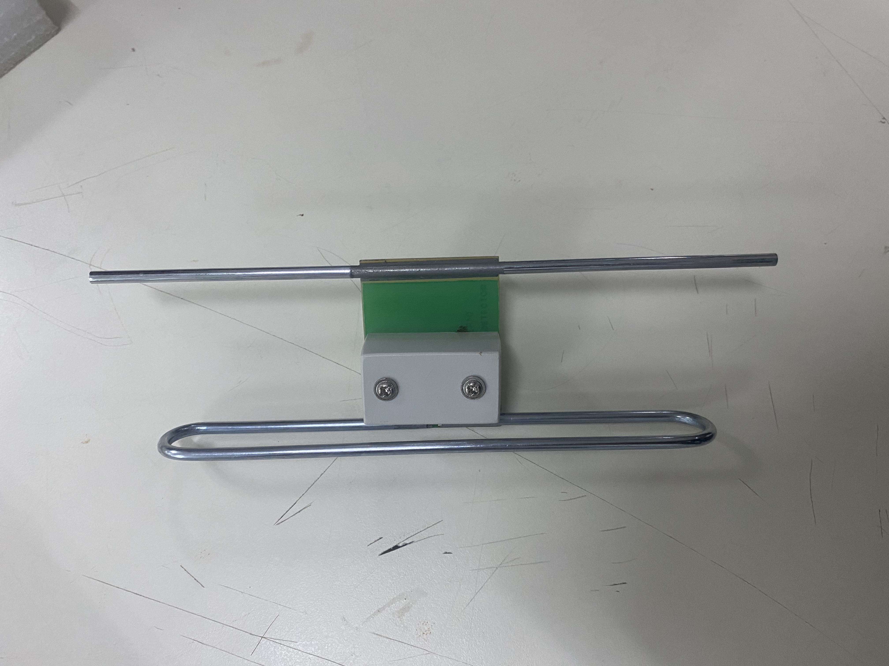
*Figure 1.19: Folded Dipole with Integrated Diode Detector. This specialized receiving element incorporates a rectification circuit to convert incident RF energy into a measurable DC voltage. It serves as a diagnostic tool for analyzing radiation patterns and verifying field strength.*

#### Theory & Function
While a standard antenna captures a signal to send to a radio or television, this specific hardware is used for Antenna Training and Measurement.
- The Detector Circuit: If you look closely at the center of the green PCB, you will see a small diode (often a Schottky diode). This diode "rectifies" the incoming RF signal, turning the alternating current (AC) of the radio wave into a direct current (DC).
- Signal Strength Indicator: This hardware is designed to be connected to a simple multimeter or a micro-ammeter rather than a receiver. The more signal the antenna catches, the higher the voltage reading on your meter.
- Resonant Loop: It maintains the same folded dipole properties: high impedance ($300\ \Omega$) and wide bandwidth, making it very sensitive to signals in its target frequency range.
#### Propagation Pattern

*Figure 1.20: Folded Dipole with Detector Antenna Propagation Pattern.*
The pattern is identical to the Folded Dipole we covered previously.
- Standard Toroid: It has a "doughnut" shape, picking up signals best from the sides and having "nulls" (blind spots) at the very tips of the metal rods.
- Polarization: It is linearly polarized. In your lab setup, if the transmitting antenna is vertical, this detector antenna must also be held vertically to get a reading.
#### Industrial Applications
- Field Strength Metering: Engineers use tools like this to walk around a transmitter and "map" where the signal is strong or weak.
- Educational Labs: This is the "receiver" used in classroom experiments. You set up a transmitter, place this detector a few meters away, and rotate it to physically see the voltage change as the antenna pattern moves.
- EMC Testing: Used to detect "leaky" electronic equipment that might be accidentally broadcasting interference.

### Simple Dipole for Paraboloid Reflector
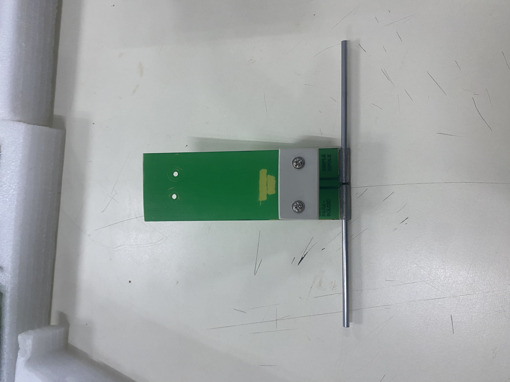
Figure 1.21: Simple Dipole Primary Radiator for Parabolic Reflector. This $\lambda/2$ dipole serves as the feed element at the focal point of a paraboloid system. It illustrates the transformation of a standard dipole radiation pattern into a high-gain, narrow-aperture beam through the use of geometric optics and reflective surfaces.*

#### Theory & Function
On its own, this is a standard half-wave ($\lambda/2$) dipole. However, in a laboratory kit, its purpose is to act as the Primary Radiator for a reflector system.
- The Feed Element: When placed at the focal point of a parabolic dish (the paraboloid), it broadcasts waves toward the dish surface.
- Collimation: The dish then reflects those waves out in perfectly parallel lines, creating a very narrow, high-energy "pencil beam."
- Polarization: Since the rod is horizontal in your photo, it creates a Linearly Polarized signal. If you rotate the board $90^{\circ}$, the polarization changes from horizontal to vertical.
#### Propagation Pattern
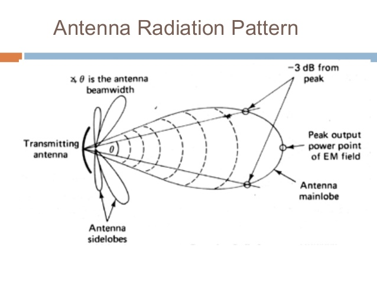

*Figure 1.22: Simple Dipole for Paraboloid Reflector Antenna Propagation Pattern.*
To understand this antenna, you have to look at it in two stages:
- Stage A: The Dipole Alone
Without the dish, it has the standard Torus (Doughnut) pattern we discussed at the very beginning. It radiates energy equally in all directions perpendicular to the rod.
- Stage B: With the Paraboloid (Reflector)
When you "plug" this dipole into the dish, the pattern changes into a highly directive beam.Main Lobe: A very sharp, narrow spike pointing directly out of the dish.
- Gain: The gain increases massively (often +20 dBi or more) because the dish "collects" all the energy from the dipole and points it in one direction.
#### Industrial Applications
- Satellite TV: The "LNB" at the center of a home satellite dish often uses a small dipole or horn feed similar to this.
- Deep Space Communication: NASA uses giant versions of this setup to talk to Mars rovers.
- Microwave Backhaul: Those drum-shaped antennas you see on cell towers use a feed antenna like this inside a protective cover to send data across cities.
- Radio Telescopes: Astronomers use reflectors fed by dipoles to listen to radio signals from distant stars.

### Phased Array 2-Element (1/4 $\lambda$) Antenna
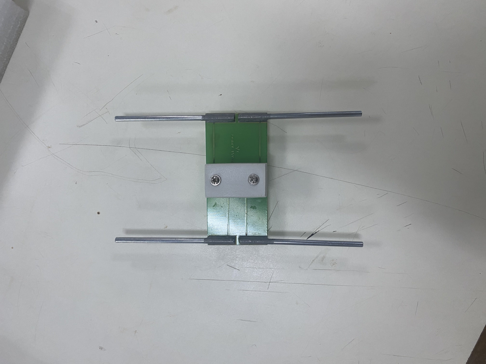
Figure 1.23: Fabricated (1/4 $\lambda$) Phased Array Prototype. This system consists of two dipole elements spaced a quarter-wavelength apart. It serves as a practical demonstration of beamforming and spatial interference, showing how phase-shifted signals can be utilized to synthesize a directional radiation pattern.*

#### Theory & Function
A phased array consists of two or more antennas (in this case, two dipoles) powered by the same source, but with a specific phase difference between the signals sent to each element.
- Constructive & Destructive Interference: By controlling the timing (phase) of the signal, the electromagnetic waves from the two dipoles can be made to add up in one direction (constructive interference) and cancel each other out in another (destructive interference).
- $\lambda/4$ Spacing: The "1/4 wavelength" in the name refers to the physical distance between the two dipole elements. This specific spacing is critical for achieving a directional radiation pattern (often a "cardioid" or "heart-shaped" pattern).
- Beamforming: While this prototype has fixed spacing, modern phased arrays use electronic "phase shifters" to change the direction of the signal beam without physically moving the antenna.
#### Propagation Pattern

Figure 1.24:Phased Array 2-Element (1/4 $\lambda$) Antenna Propagation Pattern.*

- Directional Beam: Unlike a single dipole that radiates 360°, this array focuses energy in a specific direction.
- Front-to-Back Ratio: One of the key metrics for this antenna is how much more signal it sends forward compared to what "leaks" out the back.
- Main Lobe: It produces a "Main Lobe" in the direction of constructive interference and "Nulls" where the signals cancel out.
#### Industrial Applications
- Radar Systems: This is the core technology behind modern military and weather radar. It allows the radar to "scan" the sky at lightning speed.
- 5G Base Stations: 5G uses "Massive MIMO" phased arrays to point high-speed data beams directly at individual smartphones, rather than broadcasting to the whole city.
- Starlink & Satellite Internet: The flat dishes used for satellite internet are sophisticated phased arrays that track satellites moving across the sky without a motor.
- Aviation: Used in Instrument Landing Systems (ILS) to provide a precise directional path for aircraft to follow during landing.

### Phased Array 2-Element (1/2 $\lambda$) Antenna
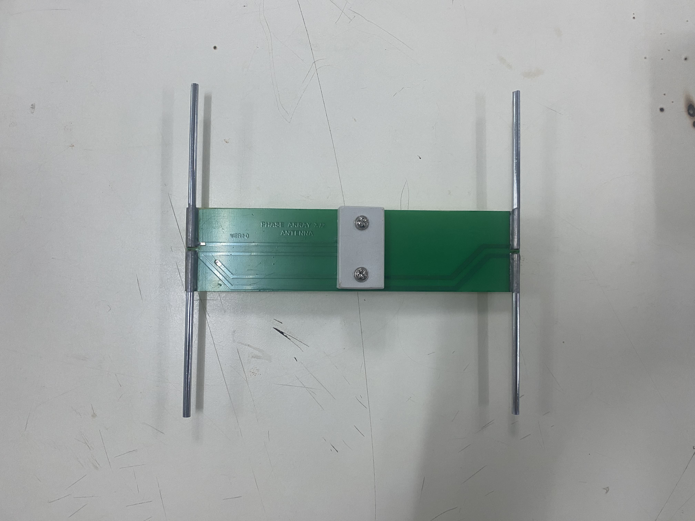
Figure 1.25: Fabricated $\lambda/2$ Phased Array Prototype. By utilizing half-wavelength spatial separation between radiators, this system demonstrates broadside directivity and high-gain bi-directional propagation. This model is essential for studying the transition from cardioid to multi-lobe interference patterns in array synthesis.*

#### Theory & Function
In this configuration, the two dipole elements are spaced exactly half a wavelength ($\lambda/2$) apart.
- Phase Interference: Because the distance between the elements has doubled compared to your previous array, the timing (phase) at which waves from one rod reach the other is shifted by $180^\circ$.
- Array Factor: In antenna theory, the spacing relative to the wavelength determines the "Array Factor." At $\lambda/2$ spacing, the interference creates a more symmetrical but highly focused set of lobes.
- Mutual Coupling: The elements are far enough apart to reduce "mutual coupling" (where one antenna's field messes with the other's impedance) compared to the $\lambda/4$ version, often making it easier to feed.
#### Propagation Pattern
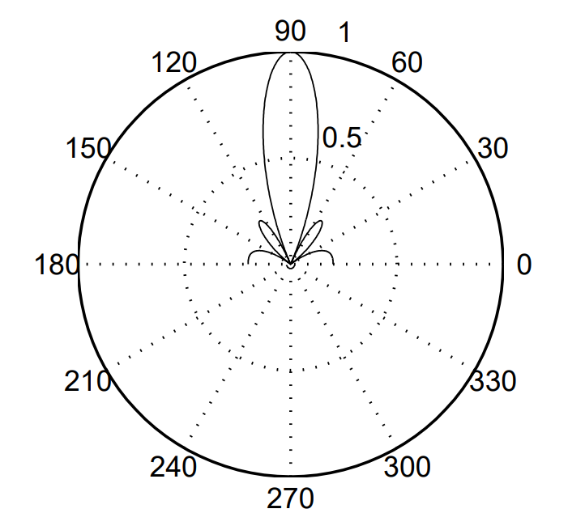

Figure 1.26: Phased Array 2-Element (1/2 $\lambda$) Antenna Propagation Pattern.*
The 2D pattern for $\lambda/2$ spacing (with elements fed in phase) is typically a Bi-directional pattern.
- Main Lobes: It produces two strong lobes perpendicular to the line connecting the two antennas (Broadside).
- Sharp Nulls: It creates very sharp "dead zones" along the axis of the array.
- Directivity: It is more "squeezed" than a single dipole, meaning it has higher gain in its two primary directions, but it loses the "heart-shaped" single-direction focus of the $\lambda/4$ array.
#### Industrial Applications
- Point-to-Point Links: Used to connect two fixed locations (like two buildings) while ignoring noise coming from the sides.
- Broadside Arrays: This is the basic building block for massive antenna "curtains" used in high-power shortwave radio broadcasting.
- Radio Astronomy: Used in interferometer arrays to create highly sensitive "viewing" windows into specific parts of the sky.
- Search Radar: Older radar systems used this spacing to create narrow vertical "fans" of energy to detect aircraft altitude.

### Combined Collinear Array Antenna
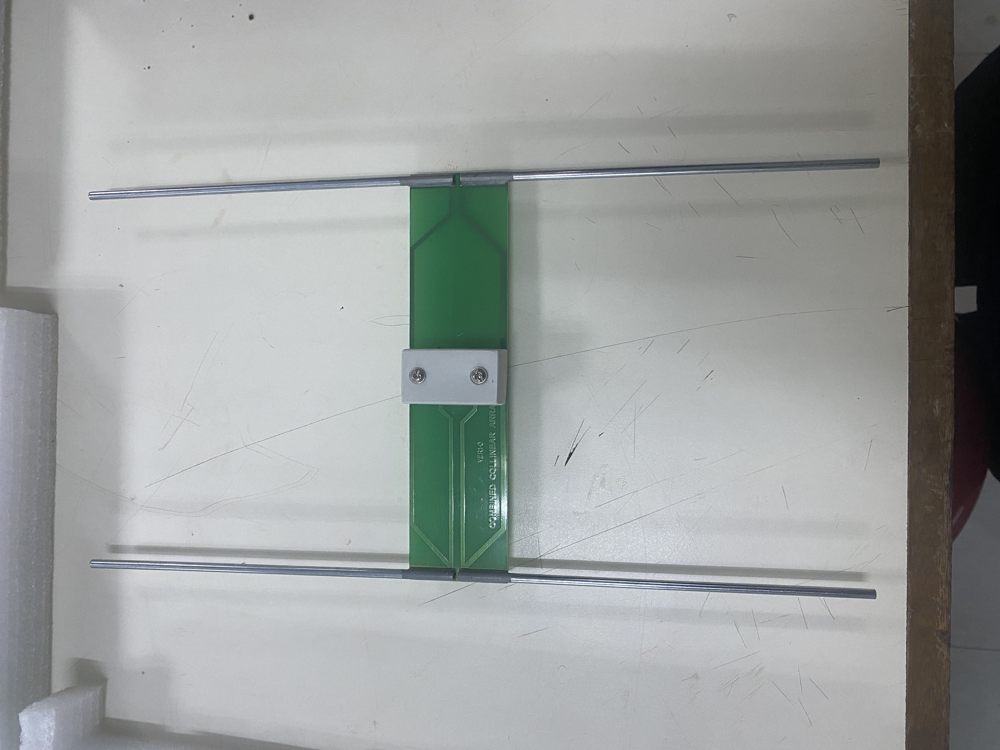
*Figure 1.27: Fabricated Combined Collinear Array. This prototype features vertically stacked dipole elements integrated onto a single feed-board. By synchronizing the phase of multiple radiators, the design achieves high omnidirectional gain by compressing the vertical beamwidth, making it an ideal model for terrestrial base station analysis.*

#### Theory & Function
A collinear array consists of two or more dipole elements (the horizontal rods in your photo) arranged in a straight line—specifically, stacked on top of each other.
- Vertical Stacking: By "stacking" the radiators, the antenna system compresses the radiation pattern. Instead of a broad "doughnut," the energy is squeezed into a very thin, flat disk.
- In-Phase Feeding: The "combined" part of the name refers to the internal wiring on the green PCB. It ensures that both the top and bottom dipoles receive the signal at the exact same time (in-phase).
- Aperture Synthesis: Stacking antennas increases the "effective aperture." In simple terms, the more vertical space the antenna occupies, the better it can "capture" or "project" a signal toward the horizon.
#### Propagation Pattern
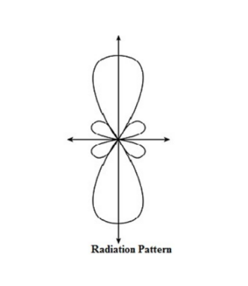

*Figure 1.28:Combined Collinear Array Antenna Propagation Pattern.*
The 2D pattern for a collinear array is Omnidirectional in the horizontal plane, but highly Directional in the vertical plane.
- Flattened Toroid: Imagine taking the standard "doughnut" of a single dipole and stepping on it. The pattern becomes a very flat, high-gain disk.
- High Gain: Because energy that would have gone into the sky or the ground is redirected toward the horizon, the "gain" (signal reach) is significantly higher than a single dipole.
- Narrow Vertical Beamwidth: The more elements you stack, the thinner the "pancake" of signal becomes. This requires the antenna to be mounted perfectly level to work effectively.
#### Industrial Applications
- Base Stations: This is the most common design for police, fire, and ambulance dispatch towers. It provides $360^{\circ}$ coverage of a city while maximizing range.
- Wi-Fi "High-Gain" Antennas: Those long, thin antennas you see on high-end routers or outdoor access points are often collinear arrays inside a plastic tube.
- Air Traffic Control: Used to communicate with aircraft at long distances while they are at a specific altitude.
- Marine Radio: Used on ships to ensure the signal reaches the horizon across the water without wasting energy pointing at the sky.

### Broadside Array (Multi-Element) Antenna
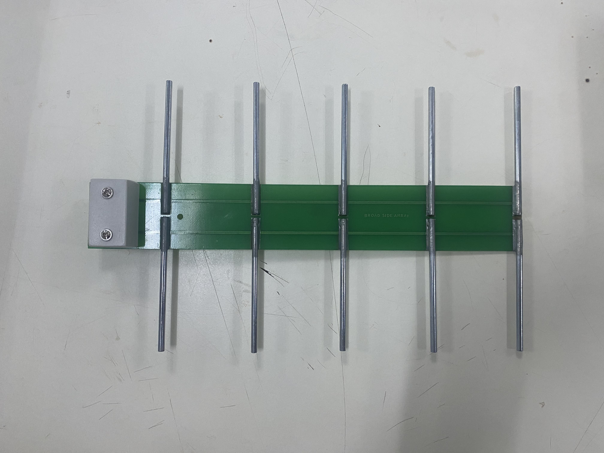
*Figure 1.29: Fabricated 5-Element Broadside Array. This high-gain configuration utilizes multiple parallel dipoles fed in-phase to synthesize a highly directive radiation beam. This prototype demonstrates the principle of narrow-beamwidth propagation perpendicular to the array axis, a core concept in long-range telecommunications and radar systems.*

#### Theory & Function
A broadside array consists of several identical dipole elements arranged in a parallel line.
- Principal of Operation: All elements in the array are fed with signals of the same phase and amplitude.
- The "Broadside" Effect: Because the signals are perfectly synchronized, the electromagnetic waves add together most strongly in the direction perpendicular (at a right angle) to the line where the antennas are mounted.
- Aperture Synthesis: By using five elements instead of one, you create a much larger "electrical eye." This allows the antenna to pick up very weak signals that a single dipole would miss.
#### Propagation Pattern
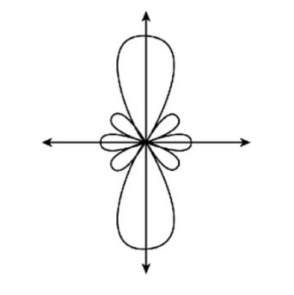

*Figure 1.30:Broadside Array (Multi-Element) Antenna Propagation Pattern.*
The 2D radiation pattern of a broadside array is highly directional.
- Narrow Main Lobes: It produces two very sharp, narrow lobes pointing "broadside".
- High Directivity: The more elements you add to a broadside array, the narrower and more "laser-like" the beam becomes.
- Side Lobes: In addition to the main beams, you will see smaller "side lobes." These are minor areas of radiation that occur because the interference isn't perfectly destructive at every single angle.
#### Industrial Applications
- Radio Astronomy: Huge rows of dipoles are used to create extremely narrow "listening" beams to track stars and galaxies.
- Long-Range Radar: Used in early-warning systems to detect objects hundreds of miles away by focusing all energy into a flat, wide slice of the sky.
- Maritime Communications: Used at shore stations to communicate with ships far out at sea.
- TV Transmission: High-power broadcast towers often use broadside arrays to ensure the signal is focused toward the population on the ground rather than wasted in the atmosphere.

### Log-Periodic Antenna (LPDA)
.jpg)
*Figure 1.31: Fabricated Log-Periodic Dipole Array (LPDA). This wideband radiator utilizes logarithmic scaling of element lengths and spacings to achieve frequency-independent performance. It is a critical model for analyzing broadband impedance matching and end-fire directional propagation across multiple octaves.*

#### Theory & Function
While most antennas are designed to work perfectly at one specific frequency, the Log-Periodic antenna is designed to work over an extremely wide bandwidth.
- The Scaling Principle: Notice how the dipole elements get progressively longer from left to right. The lengths and spacings follow a logarithmic ratio (often denoted as $\tau$).
- Self-Selecting Active Region: When a specific frequency is sent to the antenna, only the dipoles that are approximately $\lambda/2$ in length for that frequency will "activate" and radiate. As the frequency changes, the "active region" simply slides up or down the antenna.
- Frequency Independence: Because the geometry repeats itself logarithmically, the antenna's electrical characteristics (like impedance and gain) remain nearly constant across its entire operating range.
#### Propagation Pattern
-Pattern.png)

*Figure 1.32:Log-Periodic Antenna (LPDA) Propagation Pattern.*
The LPDA is a Directional Antenna with very stable performance.
- End-Fire Radiation: The signal is radiated off the "small end" of the antenna (the side with the shortest elements).
- Constant Gain: Unlike other antennas that lose efficiency as you move away from their center frequency, the LPDA maintains steady gain (typically 7–10 dBi) across a huge range.
- Moderate Beamwidth: It produces a clean, directional main lobe with minimal side lobes, making it excellent for point-to-point communication.
#### Industrial Applications
- Broadband TV Antennas: Many rooftop antennas use this design because they need to catch dozens of different channels spanning from 54 MHz to over 800 MHz.
- Spectrum Monitoring: Engineers use LPDAs to scan the airwaves for unauthorized signals because one antenna can "listen" to almost everything.
- EMC/EMI Testing: Used in labs to measure electronic interference across a wide frequency sweep without needing to swap antennas constantly.
- Military Communications: Used for "frequency hopping" radios that change channels rapidly to avoid jamming.

### 3-Element Yagi-Uda Antenna (Folded Dipole)
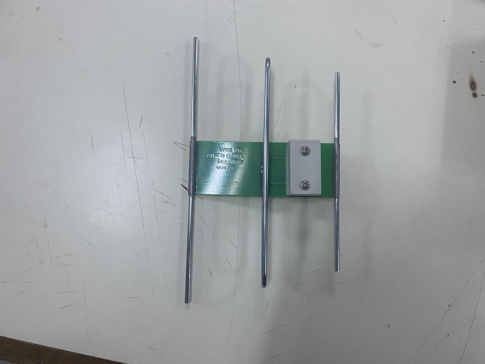
*Figure 1.33: Fabricated 3-Element Yagi-Uda Antenna. This directional array utilizes a folded dipole as the driven element, supported by a parasitic reflector and director. The configuration demonstrates the principle of parasitic coupling to achieve high forward gain and a superior front-to-back ratio for targeted signal reception.*

### Theory & Function
A Yagi-Uda antenna works through Parasitic Coupling. Only one element (the folded dipole in the middle) is actually connected to the power source. The other two metal rods are "parasitic," meaning they catch the signal from the middle rod and re-radiate it to shape the beam.
- The Reflector (Back Rod): This is the longest element. It acts like a mirror, reflecting electromagnetic waves back toward the front.
- The Driven Element (Middle Folded Dipole): This is the "heart" of the antenna. Using a folded dipole here provides wider bandwidth and a higher input impedance , which helps counteract the impedance-dropping effect of the nearby parasitic elements.
- The Director (Front Rod): This is the shortest element. It acts like a lens, focusing and "pulling" the signal in its direction.
### Propagation Pattern
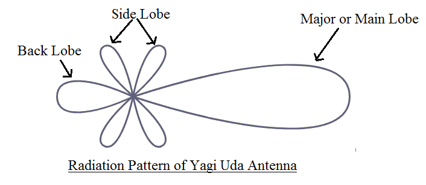

*Figure 1.34: 3-Element Yagi-Uda Antenna (Folded Dipole) Propagation Pattern.*
The Yagi-Uda is a highly Directional (Unidirectional) antenna.
- Main Lobe: It produces a strong, focused beam pointing out from the "director" side (the side with the shortest rod).
- Front-to-Back Ratio: It is very efficient at ignoring signals coming from behind the antenna, making it perfect for targeting a specific transmitter.
- Increased Gain: By adding these two parasitic elements, the gain increases significantly compared to a simple dipole, allowing you to pick up much weaker or more distant signals.
#### Industrial Applications
- Television Reception: The classic "roof antenna" seen on houses worldwide.
- Amateur Radio: Used by operators to point signals toward specific countries or continents.
- Point-to-Point Wireless: Used to bridge Wi-Fi or data signals between two buildings over long distances.
- Search and Rescue: Used on handheld receivers to "home in" on the signal of an emergency beacon.

### 5-Element Yagi-Uda Antenna (Folded Dipole)
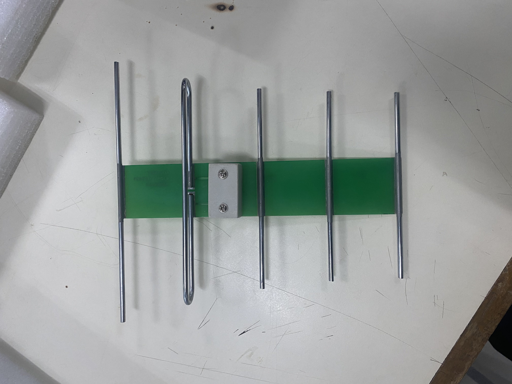
*Figure 1.35: Fabricated 5-Element Yagi-Uda Array. This high-gain directional antenna features a folded dipole driven element supplemented by one reflector and three directors. The multi-director configuration significantly narrows the beamwidth and increases forward directivity, making it an ideal model for studying high-precision point-to-point RF links.*

#### Theory & Function
This antenna works on the same parasitic principle as the 3-element version but adds more "lenses" to the front to sharpen the beam further.
- The Reflector (1 element): The longest rod at the very back. It reflects waves forward, preventing signal loss to the rear.
- The Driven Element (1 element): The Folded Dipole in the second position. It is the only part connected to the transmitter/receiver. Its folded design provides high impedance and better bandwidth.
- The Directors (3 elements): The three progressively shorter rods at the front. Each director further focuses the electromagnetic energy, effectively "squeezing" the beam into a tighter, more powerful cone.

#### Propagation Pattern

*Figure 1.36: 5-Element Yagi-Uda Antenna (Folded Dipole) Propagation Pattern.*
Adding more directors significantly changes the 2D polar plot compared to the 3-element version.
- Narrower Main Lobe: The "nose" of the pattern is much sharper and longer. This means the antenna is more sensitive but must be aimed more accurately at the target.
- Higher Gain: Because the energy is concentrated into a smaller area, the signal strength in that specific direction is much higher.
- Increased Side/Back Lobes: As you add more directors, the interference pattern becomes more complex, often resulting in more small "minor lobes" on the sides and back, though they remain much smaller than the main front beam.
#### Industrial Applications
- Long-Range Television: Used in rural areas far away from broadcast towers.
- Wireless Data Links: Used for "point-to-point" bridges between buildings several kilometers apart.
- Radio Direction Finding (RDF): Because the beam is so narrow, it is perfect for pinpointing the exact location of a radio transmitter.
- Satellite Tracking: Small versions are used by hobbyists to track and communicate with Low Earth Orbit (LEO) satellites.

### 5-Element Yagi-Uda Simple Antenna
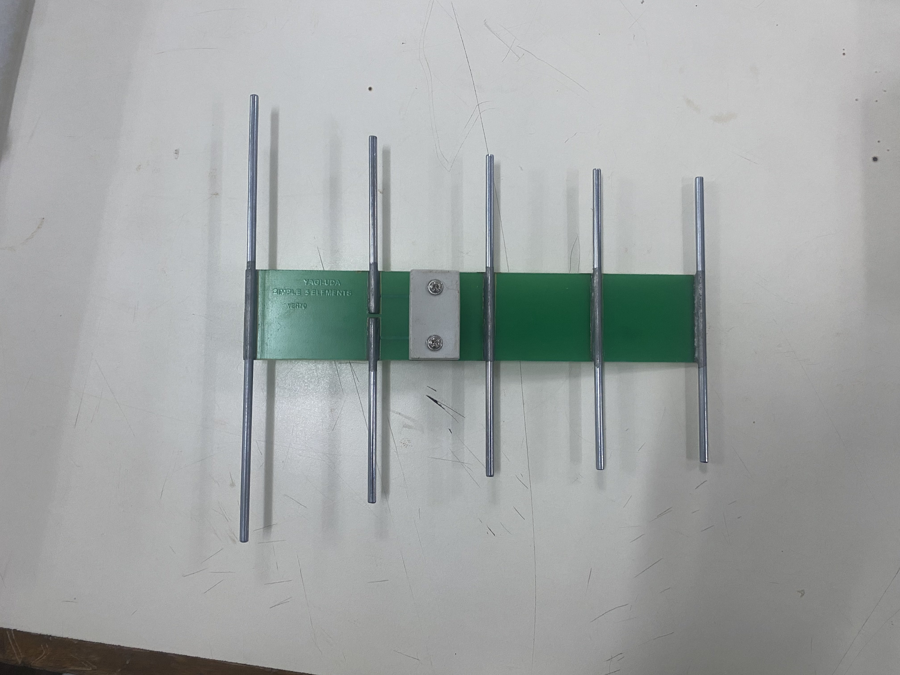
*Figure 1.37: Fabricated 5-Element Yagi-Uda Simple Array. This model utilizes a standard straight-dipole driven element supplemented by one reflector and three directors. The design demonstrates high forward directivity and high-precision beamforming, serving as a primary reference for parasitic element interaction and impedance matching in directive arrays*

#### Theory & Function
This antenna operates through electromagnetic coupling between a single powered element and four "parasitic" (unpowered) elements. By carefully choosing the lengths and spacing of these rods, the antenna forces the radio waves into a narrow, high-power beam.
- The Driven Element (Simple Dipole): This is the straight rod in the second position from the back. It is a standard $\lambda/2$ dipole. Unlike the folded version, it has a lower input impedance (typically around $73\ \Omega$ in isolation), which is further lowered by the proximity of the other rods.
- The Reflector (1 element): The longest rod at the back. It is slightly longer than a half-wavelength, causing it to act as an inductive surface that reflects energy forward.
- The Directors (3 elements): The three progressively shorter rods at the front. These are slightly shorter than a half-wavelength, making them capacitive. They effectively "pull" the signal toward the front, sharpening the beam.
#### Propagation Pattern
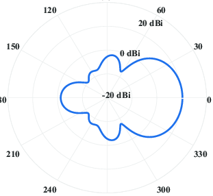

*Figure 1.38: 5-Element Yagi-Uda Simple Antenna Propagation Pattern.*
The radiation pattern is a Directive Beam pointing out from the smallest rod (the front director).
- Sharp Directivity: Because it has five total elements, the main lobe is very narrow compared to a standard dipole.
- Minor Lobes: You will notice small "bumps" or side lobes in the 2D plot. These occur because the cancellation of waves is not perfect at every angle.
- High Front-to-Back Ratio: This antenna is excellent at ignoring noise coming from behind the reflector.
#### Industrial Applications
- Rural TV Reception: Standard UHF/VHF antennas for houses far from city transmitters.
- Ham Radio (DXing): Operators use these to bounce signals off the atmosphere to communicate with other continents.
- Point-to-Point Bridges: Used to send internet signals between two tall towers or buildings.
- Search and Rescue: Handheld Yagis are used to find emergency beacons by rotating the antenna until the signal is strongest.

### 7-Element Yagi-Uda Simple Antenna
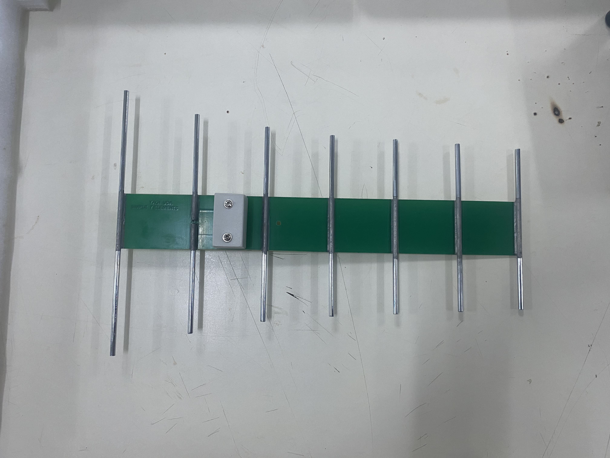
*Figure 1.39: Fabricated 7-Element Yagi-Uda Simple Array. This high-gain configuration features a single reflector, a simple dipole driven element, and five directors. The increased number of parasitic elements results in superior forward directivity and a highly compressed beamwidth, serving as an advanced model for long-range telecommunications study.*

#### Theory & Function
As you add more elements to a Yagi antenna, you are essentially adding more "lenses" to focus the beam. A 7-element version provides a significantly tighter radiation pattern than the 3 or 5-element versions we've already covered.
- The Reflector (1 element): The longest rod at the very back. It acts as the "back wall," ensuring no signal escapes behind the antenna.
- The Driven Element (Simple Dipole): The second rod from the back. This is where the cable connects. Being a "simple" dipole, it is a straight split rod.
- The Directors (5 elements): These are the five shorter rods at the front. By having five of them, the antenna "squeezes" the electromagnetic field into a very narrow, high-intensity beam.

#### Propagation Pattern
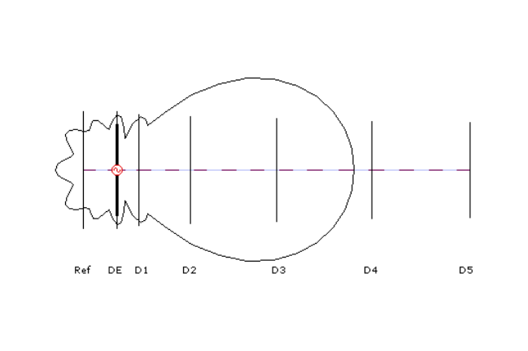

*Figure 1.40: 7-Element Yagi-Uda Simple Antenna Propagation Pattern.*
This antenna produces a highly directive "pencil beam" pattern.
- Ultra-Narrow Main Lobe: The beam is much thinner and reaches much further than the previous models.
- High Directivity: This antenna has excellent "gain," meaning it can pick up extremely weak signals, provided it is pointed exactly at the source.
- Complex Side Lobes: With seven elements, you will see more "ripples" or minor lobes in the 2D pattern, but they are very weak compared to the massive main forward beam.

#### Industrial Applications
- Point-to-Point Microwave Links: Used to bridge network connections between distant buildings or across valleys.
- Satellite Ground Stations: Used by hobbyists and researchers to communicate with satellites as they pass overhead.
- Radio Direction Finding (RDF): The narrow beam makes it incredibly accurate for "fox hunting" or locating a hidden transmitter.
- Fringe Area TV Reception: Used in locations very far from the city to pull in weak broadcast signals.

### Rhombus Antenna
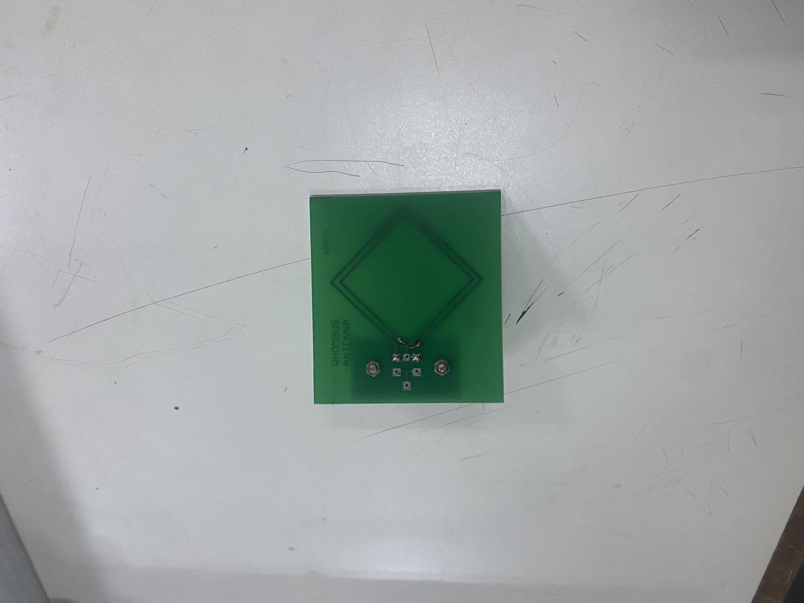
*Figure 1.41: Fabricated Rhombus (Diamond) Antenna. This traveling-wave radiator utilizes a non-resonant design to achieve high directivity. By utilizing a termination resistor at the apex, the antenna is converted from a bidirectional to a unidirectional system, providing a high-gain 'pencil beam' suitable for long-range point-to-point links.*

#### Theory & Function
A Rhombus antenna is essentially two V-antennas joined together. It is a non-resonant traveling-wave antenna, meaning the signal moves along the wires rather than bouncing back and forth like in a dipole.
- The Diamond Shape: The four sides are typically several wavelengths long. As the current travels along the wires, the radiation from each side combines constructively.
- Termination: Notice the small resistor at the tip of the diamond. This makes the antenna unidirectional. Without that resistor, the antenna would broadcast in two opposite directions; with it, it broadcasts only forward.
- High Directivity: Because of its long wire lengths, it naturally focuses energy into a very tight beam.

#### Propagation Pattern

*Figure 1.42: Rhombus Antenna Propagation Pattern.*
The Rhombus antenna produces one of the most "pointed" patterns of any wire-based antenna.
- Alignment: The main lobe points directly out of the "nose" of the diamond (away from the feed point).
- Main Lobe: It is extremely narrow, making it excellent for long-distance communication where the target location is fixed.
- Side Lobes: Because it is a long-wire antenna, you will see several small "minor lobes" alongside the main beam.

#### Industrial Applications
- Point-to-Point HF Communication: Traditionally used for international shortwave radio because it can "skip" signals off the ionosphere over thousands of miles.
- Fixed Military Links: Used for secure, long-range communication between fixed bases.
- Remote Sensing: Used in specialized radar setups to monitor specific patches of the atmosphere or ocean.

### Loop Antenna
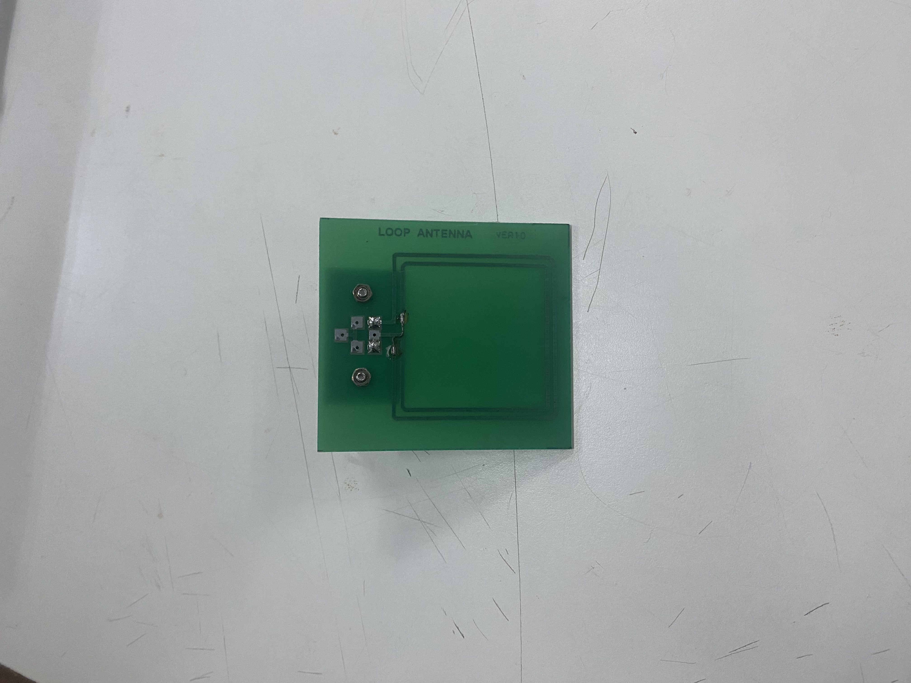
Figure 1.43: Fabricated Square Loop Antenna. This magnetic dipole element is designed to interface with the H-field component of electromagnetic radiation. It exhibits a characteristic figure-eight radiation pattern with sharp nulls along the loop's axis, making it a primary model for studying inductive coupling, NFC technology, and radio direction finding (RDF) techniques.*

#### Theory & Function
A loop antenna is essentially a coil of wire. While most antennas (like dipoles) are "Electric Dipoles," the loop is a Magnetic Dipole.
- The Magnetic Interface: It is primarily sensitive to the magnetic field ($\mathbf{H}$-field) of the incoming radio wave rather than the electric field ($\mathbf{E}$-field).
- Inductive Nature: Small loops behave like an inductor. In many lab setups, they are paired with a capacitor to create a "tuned" tank circuit that is extremely sharp at picking up one specific frequency while ignoring everything else.
- Electrical Size: Based on the PCB, this is likely a "small loop" (where the total length of the wire is less than $1/10$ of a wavelength).
#### Propagation Pattern 
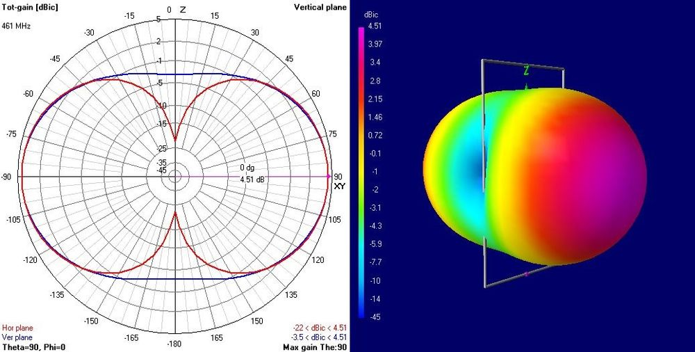

*Figure 1.44: Loop Antenna Propagation Pattern.*
The loop antenna has a very unique and useful "Figure-8" pattern, but it is different from a dipole.
- The Donut Hole: The signal is strongest in the plane of the loop (along the edges of the square).
- The Sharp Null: There is a "dead zone" or null directly through the center of the loop. If you point the "hole" of the loop at a transmitter, the signal will vanish.
- Bi-directional: It picks up signals equally well from the front and back edges, but ignores signals coming from the sides.
#### Industrial Applications
- AM Radio Reception: Almost every AM radio uses a ferrite loop antenna inside the casing.
- RFID and NFC: Your "tap-to-pay" credit card and phone use a small loop antenna just like this to transfer data over very short distances.
- Direction Finding: Because the null in the center is so sharp, sailors and pilots used to rotate loop antennas to find the exact direction of a lighthouse or radio beacon.
- Magnetic Resonance Imaging (MRI): Large-scale loops are used to pick up the tiny magnetic signals from atoms in the human body.

### Slot Antenna
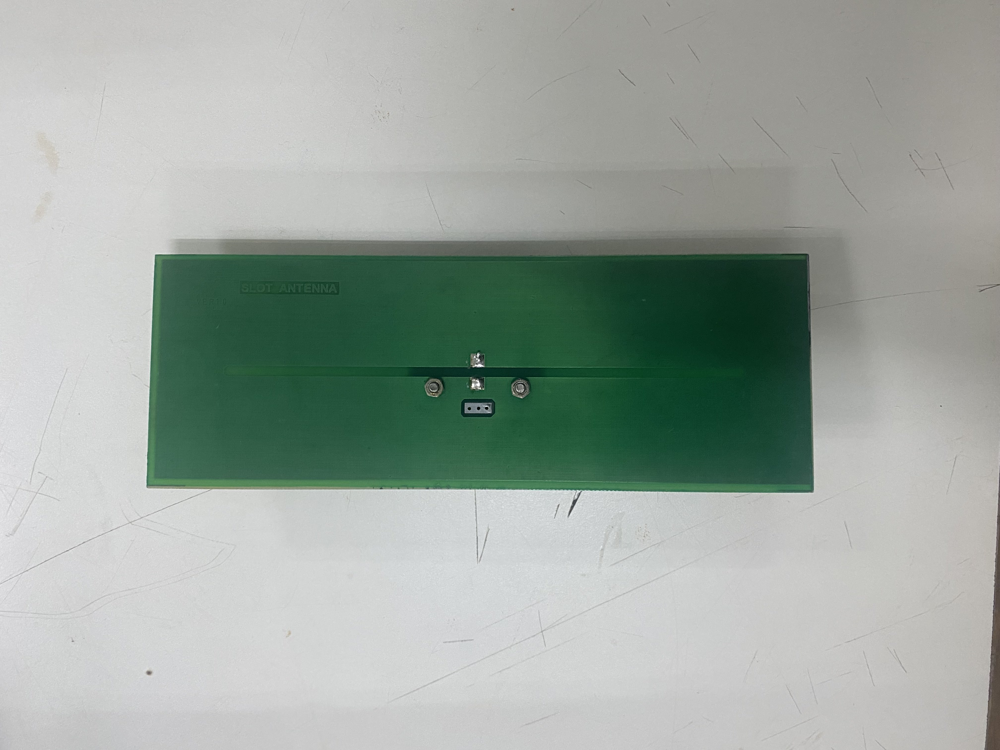
*Figure 1.45: Fabricated Slot Antenna. This aperture-type radiator illustrates Babinet's Principle of complementary structures. By exciting a rectangular opening in a conductive plane, the antenna produces a radiation pattern similar to a dipole but with orthogonal polarization. Its low-profile design is representative of antennas used in aerodynamic and conformal surface applications.*

#### Theory & Function
A slot antenna consists of a metal surface (in this case, the copper on your PCB) with a narrow rectangular slot cut out of it. When you apply an RF voltage across the narrowest part of the slot, it radiates electromagnetic waves.
- Babinet’s Principle: This is the core theory behind slot antennas. It states that a slot in a conducting plane is "complementary" to a wire dipole of the same dimensions.
- Radiation Source: Interestingly, the radiation doesn't come from the metal itself, but from the electric field distributed across the opening of the slot.
- Inverted Polarization: If a vertical wire dipole produces a vertically polarized wave, a vertical slot antenna will produce a horizontally polarized wave. This makes them very useful for changing polarization without rotating the entire structure.
#### Propagation Pattern
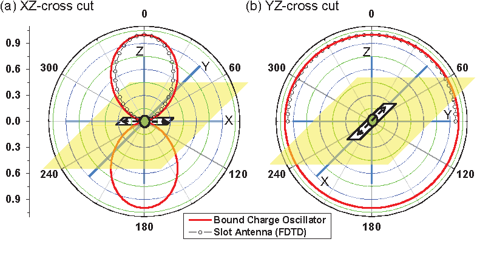

*Figure 1.46: Slot Antenna Propagation Pattern.*
Because the slot is complementary to a dipole, its radiation pattern is almost identical in shape to the "doughnut" torus, but with one major twist.
- Omnidirectional (in one plane): Just like a dipole, it radiates equally in all directions perpendicular to the slot.
- The "Shadow" Effect: Because your antenna is etched on a single-sided PCB, the pattern is slightly more "hemispherical" (radiating more strongly out of the front than through the back of the board).
- Nulls: There are deep nulls at the very top and bottom ends of the slot where no signal is radiated.
#### Industrial Applications
- Aircraft & Spacecraft: Since slot antennas are flat (low profile), they are cut directly into the metal skin of an airplane or rocket. This allows for communication without adding "drag" or sticking out like a wire.
- Cellular Base Stations: Many of the white rectangular panels on cell towers contain arrays of slots to provide wide, consistent coverage.
- Microwave Ovens: The "stirrer" or the feed that lets microwaves into the oven cavity is often a slot antenna.
- Radar: Marine and naval radars often use "slotted waveguides" to create a very wide, rotating beam.

### Ground Plane Antenna
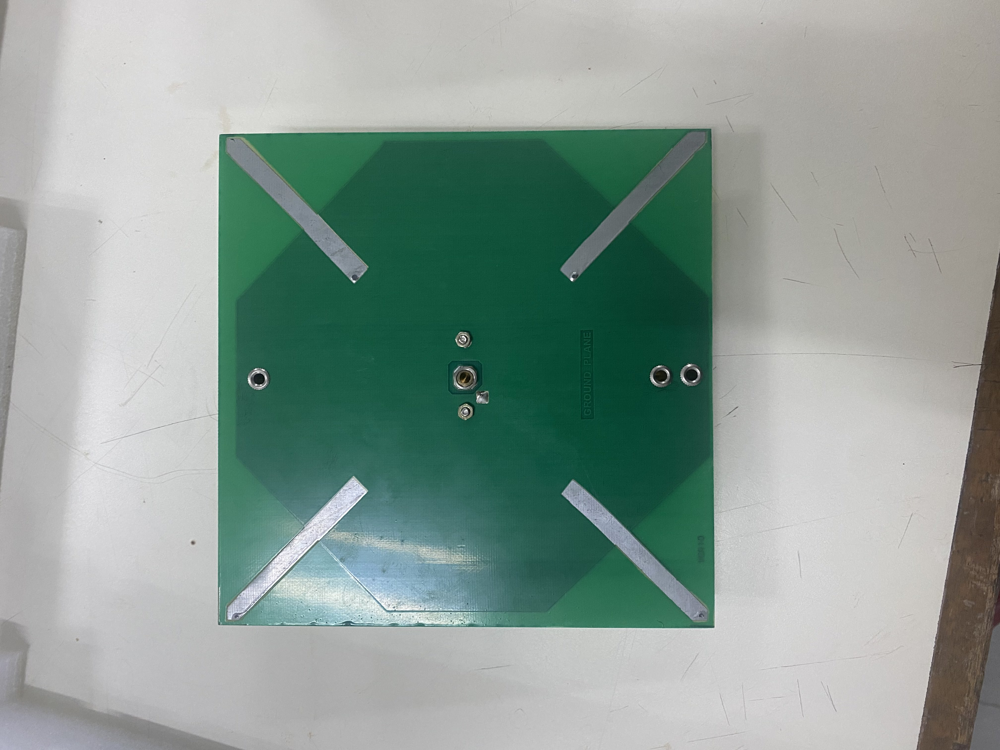
Figure 1.47: Fabricated Ground Plane Antenna. This design utilizes a central feed point supplemented by four radial elements that serve as an artificial ground (counterpoise). This configuration stabilizes the antenna's impedance and provides a $360^{\circ}$ omnidirectional radiation pattern in the horizontal plane, making it a foundational model for mobile and base station communications.*

#### Theory & Function
A standard monopole antenna needs a large metallic surface (like a car roof or the Earth) to work properly. When that isn't available, we use a Ground Plane Antenna.
- The Radiator: In a real-world setup, a vertical rod would stand up from the center connector.
- The Radials: The four diagonal silver strips you see on your PCB are called radials. They act as a "counterpoise," reflecting the radio waves to create a "virtual" second half of the antenna.
- Impedance Matching: By bending these radials downward (usually at a $45^{\circ}$ angle in 3D versions), engineers can match the antenna's impedance to exactly $50\ \Omega$, which is the standard for most radio equipment.
#### Propagation Pattern
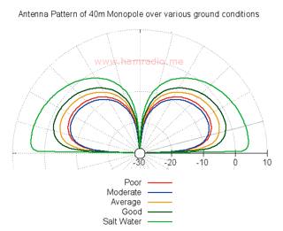

*Figure 1.48: Ground Plane Antenna Propagation Pattern.*
The Ground Plane antenna is Omnidirectional in the horizontal plane but has a specific shape in the vertical plane.
- Horizontal View (Top-Down): A perfect circle. It radiates equally in all directions ($360^{\circ}$), which is why it is used for broadcast stations.
- Vertical View (Side-On): It looks like two lobes tilted slightly upward. The radials "push" the signal toward the horizon, which is exactly where you want it for long-distance communication.
- The "Sky" Null: There is a deep null directly above the antenna. It does not waste energy shooting signal straight up into space.
#### Industrial Applications
- Emergency Services: Police and fire department vehicles use these on their roofs to maintain constant communication while moving.
- Marine Radio: Boats use them because the water acts as a natural ground, but the radials ensure a stable signal even in rough seas.
- Aviation: Airport towers use ground plane arrays to talk to pilots in every direction.
- Base Stations: Used for "Citizen's Band" (CB) radio and Ham radio hobbyists.

## Part 2: Waveguide and its parts
Waveguides represent the primary medium for low-loss, high-power microwave transmission. By constraining electromagnetic fields within a hollow metallic structure, we eliminate radiation leakage and dielectric losses. Understanding the cutoff frequency and the $TE_{10}$ propagation mode is essential for analyzing the passive components found in X-band microwave benches.
### Fundamentals of Waveguides
#### The Geometry of Guidance
Unlike a standard cable with two conductors (signal and ground), a waveguide is a single-conductor hollow pipe. Because it is enclosed, it completely contains the electromagnetic field, preventing radiation loss and protecting the signal from outside interference.
- X-Band Standard: Most laboratory kits like yours use "X-band" waveguides, which have a rectangular opening of roughly 22.86 mm x 10.16 mm.
- Aperture Dimensions: The wide dimension is usually labeled as $a$ and the narrow dimension as $b$. The relationship between these determines which frequencies can pass through.
#### Cutoff Frequency ($f_c$)
A waveguide acts as a High-Pass Filter. It will only transmit signals if the wavelength is small enough to "fit" inside the pipe.
- The Limit: If the frequency is too low (the wavelength is too long), the wave cannot propagate and simply dies out.
- Calculation: For the most common mode in a rectangular waveguide, the cutoff wavelength is $\lambda_c = 2a$. Any signal with a wavelength longer than twice the width of the guide will not pass.
### Propagation Modes (TE vs. TM)
Since there is no center wire, waves cannot travel in a straight line like they do in a coax cable. Instead, they "bounce" off the internal walls in specific patterns called modes.TE (Transverse Electric): The electric field is entirely perpendicular to the direction of travel. 
- The $TE_{10}$ mode is the standard "dominant mode" used in almost all microwave engineering.
- TM (Transverse Magnetic): The magnetic field is entirely perpendicular to the direction of travel.
- TEM (Transverse Electromagnetic): This mode cannot exist in a hollow waveguide because it requires two separate conductors (like a coaxial cable).

*Figure 2.1: TE,TM,TEM Propagation Modes.*

